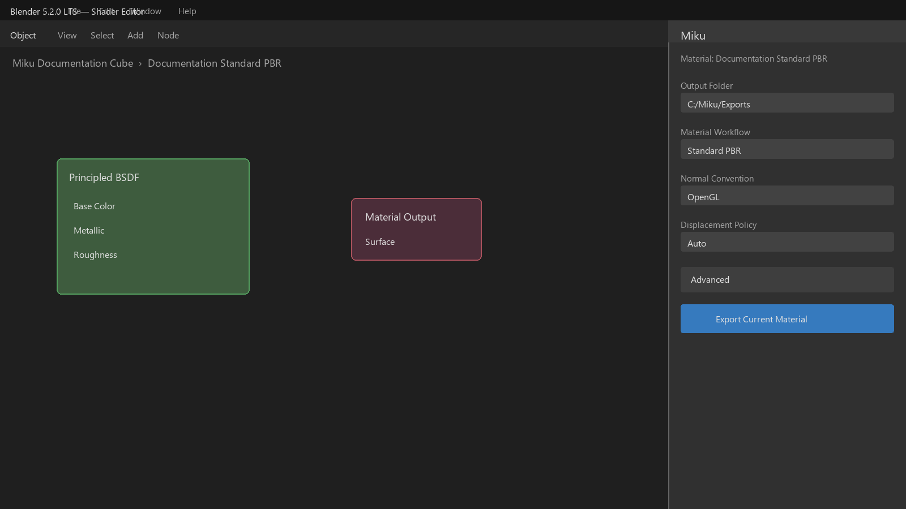
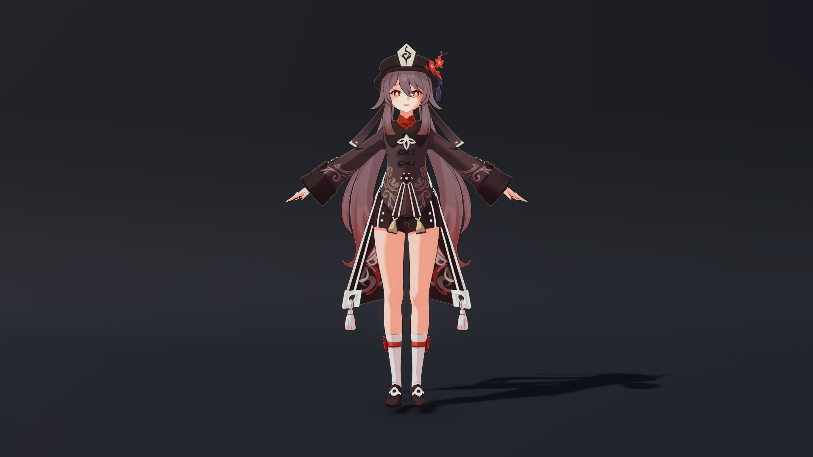
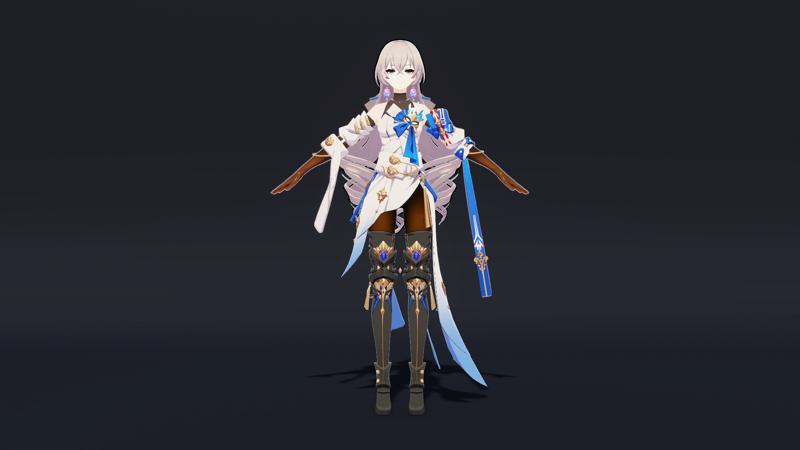
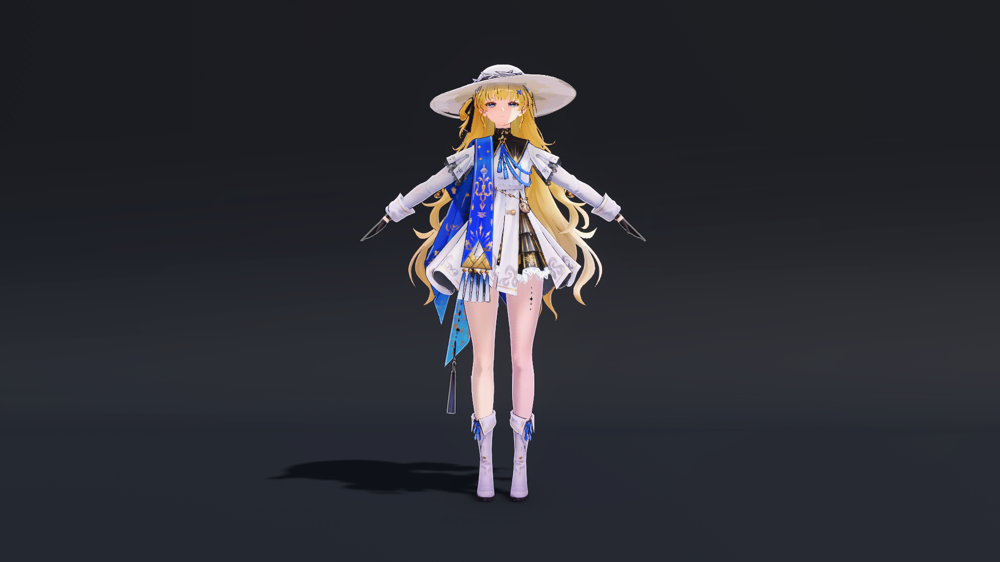
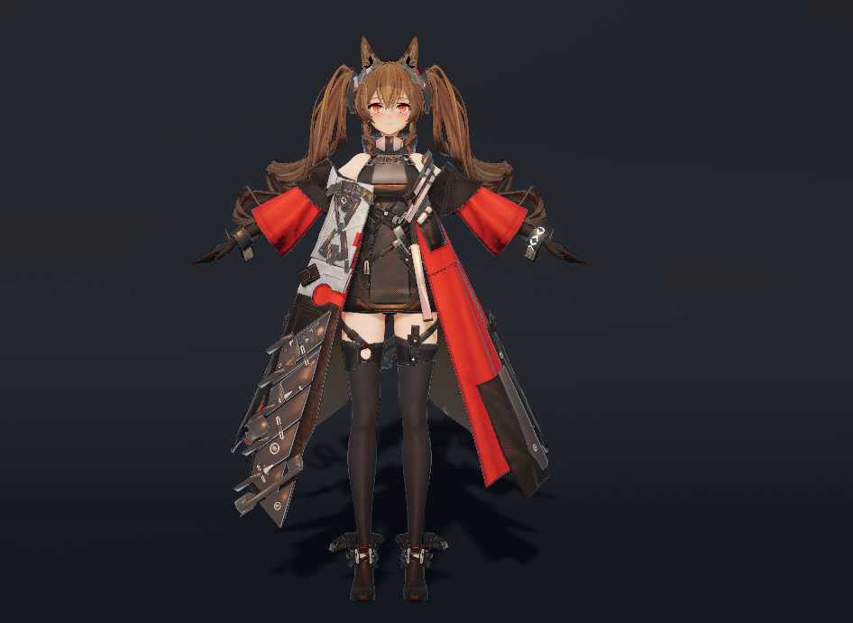
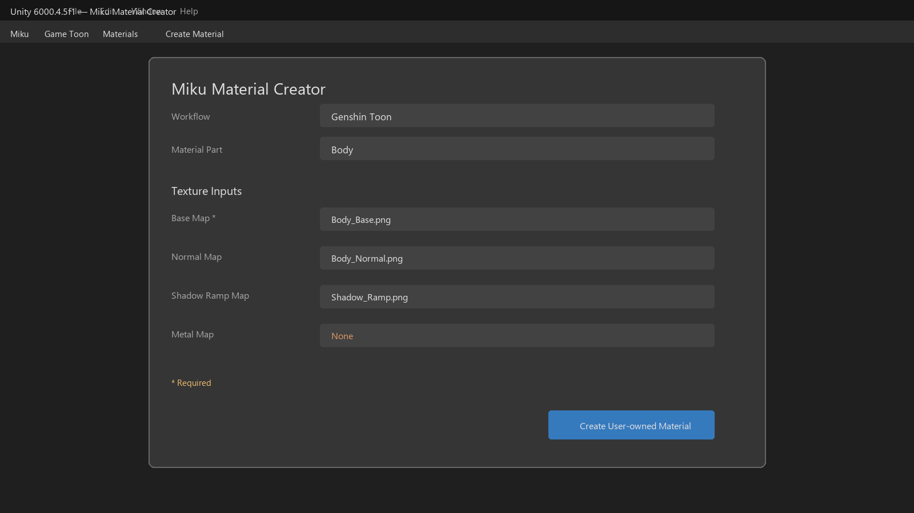

# Miku 2.3.0 Manual

Miku is a production-oriented Blender 5.x to Unity 6 material converter. The
public Blender front end exports Standard PBR semantics into target-neutral
MaterialIR 2.0. Unity imports editable Shader Graph assets and also ships four
first-party Game Toon Shader/HLSL preset families for explicit Unity-side
authoring.

This English manual is the canonical version. The
[Simplified Chinese manual](zh-CN/manual.md) mirrors its structure and
compatibility claims. See the [English README](../README.md) for the short
project overview.



## 1. Supported environment

| Component | Version | Status |
| --- | --- | --- |
| Blender | 5.0-5.2 (certified: 5.2.0) | Supported on Windows |
| Unity Editor | 6000.0-6000.5 (certified: 6000.5.7f1) | Matching technical-line adapter |
| Universal Render Pipeline | 17.5.4 | Required |
| Shader Graph | 17.5.4 | Version-specific backend |
| Miku | 2.3.0 | Experimental |

Unity 6000.N requires URP 17.N and Shader Graph 17.N, where N is 0 through 5;
URP and Shader Graph must have exactly the same package version. Stable `f`/`p`
patches and Blender 5.0-5.2 patches outside the recorded matrix emit
unvalidated-version diagnostics and must pass capability preflight. Alpha,
beta, RC, Blender 5.3+, Unity 6000.6+, and package 17.6+ fail before asset
writes. This release is formally validated on Windows only.

## 2. Install from a Release

Download these files from the
[v2.3.0 GitHub Release](https://github.com/GenshinmasterJinHang/Miku-Material-Converter-Blender-to-Unity-/releases/tag/v2.3.0):

- `miku_shader_converter-2.3.0.zip` — Blender 5.0-5.2 extension.
- `com.miku.shaderconverter-2.3.0.tgz` — single Unity 6000.0-6000.5 package.
- `SHA256SUMS.txt` — release integrity manifest.

In Blender, choose **Edit > Preferences > Extensions > Install from Disk** and
select the ZIP. In Unity, choose **Window > Package Manager > + > Add package
from tarball** and select the TGZ. Enable an in-range URP and Shader Graph 17.x
version before importing a bundle.

For source development, add
`unity/Packages/com.miku.shaderconverter/package.json` from disk. Do not patch
an installed Blender extension or validation-project copy. The canonical source
roots are `miku/`, `miku_blender/`, `extensions/miku_shader_converter/`, and
`unity/Packages/com.miku.shaderconverter/`.

## 3. Blender: export Standard PBR

1. Open a material in the Shader Editor and select an object whose active
   material slot contains that material.
2. Open the **Miku** sidebar and choose an output folder.
3. The visible route is **Standard PBR**. Set the normal convention and
   displacement policy only when the source needs them.
4. Expand **Advanced** for conversion mode, fidelity policy, additive shader
   energy policy, bake texture quality, or source identity forking.
5. Click **Export Current Material**.



The exporter snapshots the material, validates the lowered IR, and only then
creates staging and output files. A reachable time expression fails with
`MIKU_TIME_INPUT_UNSUPPORTED` before output or bake requests are written.
Disconnected time nodes are allowed. Use a static source or a separate runtime
implementation when animation is required.

The Blender UI no longer offers Game Toon workflow selection, texture-role
guessing, or the legacy identity migration entry point. Existing workflow
properties remain in `.blend` files for compatibility, and the lower-level
Python API still accepts explicit legacy workflows for scripts and fixtures.
The public current-material operator always emits `standard_pbr` without
rewriting old properties.

### Bake quality

Advanced **Bake Texture Quality** values are 512, 1024, 2048, and 4096; the
default is 1024. The setting has no effect when the conversion plan schedules
no bake. Baking uses isolated temporary data and does not modify the source
`.blend` file.

### Exported ownership

The output directory contains a deterministic `.mikubundle`, reports, and any
required baked resources. Move the complete directory into Unity as one unit.
Do not rename files inside the bundle or copy only its JSON document.

## 4. Unity: import an editable Bundle

Copy the complete `.mikubundle` directory under `Assets/`. The importer creates
the version-specific Shader Graph wrapper, Miku-owned generated Sub Graph,
materials, reports, and source mappings with stable IDs and deterministic
ordering.

Ownership is explicit:

- `*.generated.shadersubgraph` and generated reports are Miku-owned and may be
  regenerated.
- The wrapper `*.shadergraph` is user-owned after initial creation.
- A modified wrapper is replaced only after explicitly choosing full
  regeneration.

MaterialIR 2.0, Bundle 1.0, conversion-plan, bake-result, and public Shader
property/reference names remain stable in 2.3.0. Historical bundles, including
older runtime-time contracts, remain readable even though the current Blender
front end creates no new time-dependent bundle.

## 5. Bundled Game Toon Shader/HLSL presets

The Unity package includes original Miku Shader/HLSL implementations under its
four runtime preset families. They are not extracted game shaders and are more
than material-field templates.

| Preset | Parts | Authored features and texture families |
| --- | --- | --- |
| Genshin | Body, Hair, Face, Eye | Light Map and shadow/hair ramps, Face SDF, hair specular, eyes, outlines, and screen-rim integration |
| Honkai: Star Rail (HSR) | Body, Hair, Face, Eye | Light Map/ramp Toon shading, Face SDF, hair highlights, eyes, and outlines |
| Wuthering Waves (Wuwa) | Body, Hair, Face, Eye, Effect | ID/Stockings maps, face basis controls, Face ID/HET/SDF, Eye HET/HDMF/highlights/EG, MatCap, effects, and emission |
| Arknights: Endfield | Body, Skin, Hair, Face, Eye, Mouth, Overlay, Effect, HairShadow | Material parameters, diffuse/specular ramps, shadow/color LUTs, Face SDF, hair line/shift/refine maps, overlays, effects, and hair shadow |

These 22 valid material parts are **Experimental** compatibility presets. They
do not promise pixel-exact parity with any game and do not include game models,
textures, logos, extracted Shader source, or other game assets.

The Genshin preset supports the published Genshin tutorial's `diffuse.a`
cutout/emission modes, UV1 double-sided back faces, vertex-color A outline
width, and lightmap.a region outline colors. These controls are opt-in
material properties (`_DiffuseA`, `_DoubleSided`, `_BackUV1`,
`_OutlineColorMode`, and friends); defaults preserve the legacy Miku look.
Body and Hair also accept an optional `_NormalMap`/`_BumpScale` pair (the
`NormalMap` texture role); when `_AREA_SKIN` is on, the legacy skin-tone
curve is limited to LightMap-masked skin regions so cloth and capes keep
their authored color.

### Documentation render gallery

| Genshin — Hu Tao | Honkai: Star Rail — Bronya |
| --- | --- |
|  |  |
| Wuthering Waves — Phoebe | Arknights: Endfield — 洁尔佩塔 |
|  |  |

> **Non-commercial image notice:** The four character renders above are
> provided solely for non-commercial learning and documentation reference.
> Commercial use is prohibited. All related characters, designs, and
> intellectual property belong to their respective rights holders; Miku grants
> no rights to game assets. These images are not part of the Blender or Unity
> installable packages or the 2.3.0 release candidates.

## 6. Unity Game Toon material creator

Open **Miku > Game Toon > Materials > Create Material**.

1. Select `genshin_toon`, `hsr_toon`, `wuwa_toon`, or `endfield_toon`.
2. Select one part from the filtered list in section 5.
3. Assign the displayed `Texture2D` fields explicitly. Fields follow the
   selected package shader's public 2D texture declarations in source order.
4. Resolve every field marked **Required**, then click
   **Create User-owned Material** and choose a new `.mat` path under `Assets/`.



`_MainTex` and `HideInInspector` compatibility properties are excluded.
`_BaseMap` is required for every part except Endfield Mouth. Wuwa Body exposes
one **ID / Stockings Map** field and binds that texture to both `_IDMap` and
`_StockingsMap`.

Before creating a Unity object, the wizard validates the shader, output path,
existing asset, field count, required textures, and property names. It then
binds textures in memory, applies the recommended profile, synchronizes
keywords, and creates a user-owned `.mat`. It never guesses filenames, searches
folders, changes TextureImporter settings, overwrites a material, binds a
Renderer, or modifies an FBX or Prefab.

The public three-argument `CreateMaterialAsset(string, string,
MikuGameMaterialPart)` API remains available for scripts that deliberately need
an empty user-owned template. The visible creator uses the validated configured
creation route.

## 7. Unity Editor tools

### 7.1 Miku settings

Open **Miku > Settings** to open Unity User Preferences at **Preferences/Miku**.
Choose English or Simplified Chinese. This is a per-user `EditorPrefs` value;
it does not alter project files or generated assets. See section 8 for the
localization boundary.

### 7.2 Recommended skin and highlight profile

Select one or more Material assets, then choose
`Miku > Game Toon > Materials > Apply Recommended Skin & Highlight Profile`.
Confirm the dialog to update
only properties supported by each selected Miku preset shader, synchronize its
keywords, and save the materials. The operation supports Undo and never changes
FBX or Prefab assets. A missing required skin mask produces
`MIKU_SKIN_MASK_TEXTURE_MISSING` and disables unsafe whole-surface skin tuning.

### 7.3 Endfield texture import audit

Open **Miku > Game Toon > Textures > Import Audit**, assign an `Assets/` folder,
then click **Apply Recognized Import Settings**. Despite its audit name, this is
a mutating tool: it recognizes complete Endfield filename patterns, adjusts
TextureImporter color space, wrap mode, mipmaps, and type, then reimports
changed textures. Ambiguous `_M` names are left unchanged. It writes the before/
after report to
`Assets/Miku/Reports/endfield-texture-import-audit.json`.

Commit or back up importer metadata before applying it. Review the JSON report
afterward and use source control or Unity Undo if a recognized profile was not
intended.

### 7.4 Smooth Normal Generator

Select a Mesh asset and open
`Miku > Game Toon > Mesh > Smooth Normal Generator`. Confirm the explicit
source Mesh and output folder (default
`Assets/Miku/ToonMeshes`), then set position tolerance, smoothing angle, and
whether bone-weight signatures separate otherwise coincident vertices.

The generated smooth outline normal is written as marked tangent-space
`float4(normalTS.xyz, 2.0)` data in UV7/TEXCOORD7 on a cloned Mesh asset. This
2.3.0 contract deforms with a SkinnedMeshRenderer; unmarked historical
object-space UV7 remains readable. If the source already has UV7, **Preserve**
blocks a normals-only write; choose **Replace** and confirm to replace UV7 only
on the clone. Missing or invalid tangents report
`MIKU_TOON_TANGENTS_REQUIRED` before any UV7 write. The source Mesh,
Texture/Mesh importer, and all Renderer references remain untouched, including
for a non-CPU-readable imported Mesh. See the
[migration note](migrations/outline-tangent-space-v2.md).

### 7.5 Screen Rim Installer

Open **Miku > Game Toon > Rendering > Screen Rim Installer** and select exactly
one Universal Renderer Data asset. **Preview** is read-only. **Apply** adds one
`MikuToonScreenRimRendererFeature` only to that asset and supports Undo. Applying
again is a no-op; if Preview reports multiple existing Miku features, remove
unwanted duplicates manually. Ensure a URP asset is active before opening the
tool.

### 7.6 Rebuild Anime Global Volume Profile

Choose
`Miku > Game Toon > Rendering > Rebuild Anime Global Volume Profile` only to
restore Miku's package-owned reference profile. The command deletes and
recreates
`Packages/com.miku.shaderconverter/Runtime/Profiles/MikuAnimeGlobalVolumeProfile.asset`
with Miku's Neutral tonemapping, color, Bloom, and Vignette defaults, then
selects it. It is destructive to edits made directly to that package asset and
has no preview. Keep custom grades in a separate user-owned Volume Profile; if
an immutable installed package rejects the rebuild, reinstall the package.

### 7.7 Endfield LUT and tutorial lighting

Open **Miku > Game Toon > Rendering > Endfield LUT & Volume Installer** to
install one project-owned flattened 32-cube LUT before URP post processing and
create the strict Neutral/Bloom/Vignette profile. The tool validates and
configures the LUT importer, supports Preview and Undo, updates an existing
Miku feature without duplication, and rolls back a failed attempt. It does not
use the URP ColorLookup Volume component and does not assign the generated
profile to a scene automatically.

Add exactly one `MikuEndfieldLightingController` to a scene to enable the 2.3.0
Endfield tutorial contribution. Without it, old lit materials retain legacy
lighting. Overlay independently defaults to `_LightingMode=0` (Legacy Unlit);
set `_LightingMode=1` to choose Toon Lit Transparent before the controller can
contribute tutorial lighting to that material.
Setup, defaults, the double-sided Body contract, part-specific behavior, and
validation requirements are in the
[Endfield tutorial rendering guide](features/endfield-tutorial-rendering.md).

### 7.8 Miku Material Inspector

Select a material using a `MIKU/Genshin/`, `MIKU/HSR/`, `MIKU/Wuwa/`, or
`MIKU/Endfield/` shader. The custom Inspector displays the shader's public
properties, synchronizes texture keywords, exposes supported Wuwa/Endfield
debug views, shows Screen Rim installation status, and—when a companion recipe
exists—offers a filtered material-part selector. Changes affect the selected
material; use Undo and review debug views before returning them to **Final**.

### 7.9 Mesh Binding Description Inspector

Select a generated `MikuMeshBindingDescription`, then select a GameObject with
a `MeshRenderer` and `MeshFilter` whose Mesh fingerprint matches the recorded
binding. Click **Apply to Selected Renderer** to assign the recorded material to
the specified slots. A mismatch reports `MIKU_MESH_BINDING_MISMATCH` and makes
no assignment. The successful operation records Renderer Undo; use the
generated Prefab when possible.

### 7.10 Toon Material Recipe Inspector

A `MikuToonMaterialRecipe` records the generated base material, user material,
workflow, part, texture bindings and UV transforms, stable identities, and
Shader family version. Treat GUID and version fields as synchronization
metadata, not ordinary controls. To change a recipe-backed material part, use
the Miku Material Inspector's part selector so the shader, bindings, recommended
profile, and recipe stay synchronized. Raw Recipe Inspector edits alone do not
apply a material regeneration.

### 7.11 Legacy migration tools

For historical MiGR assets only, first select explicit assets or folders and
run **Miku > Migration > Dry Run Selected MiGR Assets**. Review the logged
material, animation-curve, and generated-metadata counts. After committing or
backing up the project, run **Miku > Migration > Upgrade Selected MiGR Assets**
to apply the property and metadata-name migration.

The migration does not traverse scene objects or change Renderer assignments.
It rejects retired Generic Toon materials instead of silently substituting a
different shader. Normal 2.3.0 authoring does not require these commands.

## 8. Editor languages

Blender follows Blender's English/Simplified Chinese interface translation.
Unity's **Miku > Settings** preference is stored for the current user at
`com.miku.shaderconverter.editorLanguage`.

The preference does not change Unity's global language, project files,
generated assets, stable property names, diagnostics, JSON, or static menu
paths. Miku-authored windows, custom inspectors, ShaderGUI labels, dialogs,
help boxes, Undo labels, and friendly status messages follow the preference.

## 9. Diagnostics and troubleshooting

- `MIKU_TIME_INPUT_UNSUPPORTED`: remove a reachable time dependency from the
  Blender output chain or keep the historical bundle on Unity for compatibility.
- `MIKU_WORKFLOW_RETIRED:generic_toon`: export Standard PBR from Blender or use
  one of the four Unity Game Toon presets.
- `MIKU_REQUIRED_TEXTURE_MISSING`: assign the creator's required Base Map;
  Endfield Mouth is the only exception.
- `MIKU_MATERIAL_ALREADY_EXISTS`: choose a new `.mat` path; Miku will not
  overwrite the existing material.
- `MIKU_ASSET_OUTPUT_PATH_INVALID`: choose a `.mat` path under `Assets/` without
  `.` or `..` path segments.
- `MIKU_TEXTURE_AUDIT_FOLDER_INVALID`: select a valid Unity folder before
  applying the Endfield importer profiles.
- `MIKU_RENDERER_DATA_SELECTION_REQUIRED`: select a Universal Renderer Data
  asset before applying Screen Rim.
- `MIKU_MESH_BINDING_MISMATCH`: use the generated Prefab or select a Renderer
  whose Mesh fingerprint matches the description.
- Missing shader or incompatible graph format: verify the exact Unity, URP, and
  Shader Graph tuple before importing or creating materials.

If an upgraded project shows Missing Shader, the package does not delete the
material. Back up the project, then deliberately recreate the user-owned
material with Standard PBR or a supported Unity Game Toon preset.

## 10. Development and validation

```powershell
py -3.13 -m unittest discover -s tests -p "test_*.py"
py -3.13 tools/ci/run_checks.py --profile pr
py -3.13 tools/ci/run_checks.py --profile release
py -3.13 tools/release/build_release.py --output-dir artifacts
```

The required Blender executable is
`C:\SteamLibrary\steamapps\common\Blender\blender.exe`. The validated Unity
executable is
`C:\Program Files\Unity\Hub\Editor\6000.4.5f1\Editor\Unity.exe`. Validation
must assert editor versions before using generated evidence.

Read [CONTRIBUTING.md](../CONTRIBUTING.md), [SECURITY.md](../SECURITY.md),
[SUPPORT.md](../SUPPORT.md), the [compatibility matrix](compatibility.md), and
the [release process](release/process.md) before distributing a build.

## 11. License and documentation assets

The repository's MIT-licensed code retains the MIT License; files with separate
SPDX terms, including the Blender Bake Worker, retain those terms. The four
character renders in section 5 are separately restricted to non-commercial
learning and documentation reference; commercial use is prohibited. Their
hashes and scope
are recorded in [documentation image provenance](provenance/documentation-images.md)
and [Third-party notices](../THIRD_PARTY_NOTICES.md). This image restriction
does not change any existing code license.
