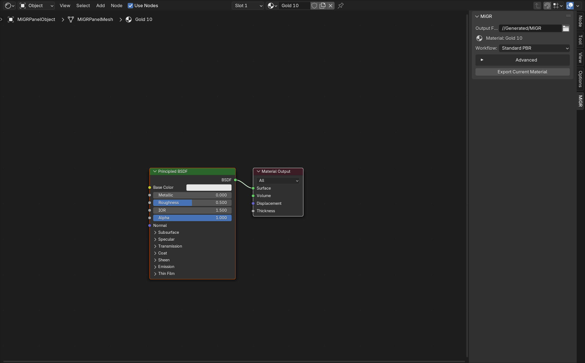

# Miku 2.1.0 安装与导入

## Blender 5.2

在“编辑 → 偏好设置 → 扩展 → 从磁盘安装”中依次安装：

1. `miku_semantic_exporter-2.1.0.zip`（MIT，必装）
2. `miku_gpl_bake_worker-1.2.0.zip`（GPL，仅在需要烘焙时安装）

不要修改 Blender 的 Scripts 目录，也不要复制源码包。每个材质直接保存一个
明确工作流：`standard_pbr`、`generic_toon`、`genshin_toon`、
`wuwa_toon` 或 `hsr_toon`。

本机所有启动、安装、headless 测试和导出验证只允许直接使用
`C:\SteamLibrary\steamapps\common\Blender\blender.exe`，并在执行前确认
`bpy.app.version == (5, 2, 0)`。覆盖安装前必须保存并关闭 Blender GUI；
不得从 `PATH`、Steam launcher、`.tools` 或其他副本回退。

在 Shader Editor 的 Miku 侧栏中：

1. 选择物体和要导出的活动材质槽。
2. 选择当前材质的唯一 `Workflow`。不再有场景默认与材质覆盖两套选项。
3. 仅当选择 Genshin/WuWa/HSR 时设置 `Game Part`。
4. 选择 `Output Folder`，点击 **Export Current Material**。

每次只导出活动材质槽里的一个材质，不会读取当前物体的其他槽或场景其他
物体。`Persistent Source ID` 已从界面隐藏并由插件自动保持稳定。未保存的
`.blend` 可以导出，但会提示先保存以便长期持久化身份。`Conversion Mode`
位于默认收起的 `Advanced` 中，默认值为 `Auto`。

导出结果是一个完整目录，其中入口文件扩展名为 `.migrbundle`。请整目录
复制，不要只复制入口文件，也不要改名为 `.json`。

## Unity

支持的精确组合为 Unity `6000.4.5f1`、URP `17.4.0`、Shader Graph
`17.4.0`。安装 `com.miku.shaderconverter` 1.2.1 后，把 Blender 输出目录
复制到 `Assets/`。Unity 会自动排队生成 Shader Graph、Sub Graph、基础材质、
用户 Material Variant 和导入报告。

旧 `.miku` 只会生成诊断资产并在 Console 报告“请从 Blender 重新导出”。
Miku 不提供 MIKU 2/3/4/5 或 `.b2ubundle` 的 Unity 迁移器。
