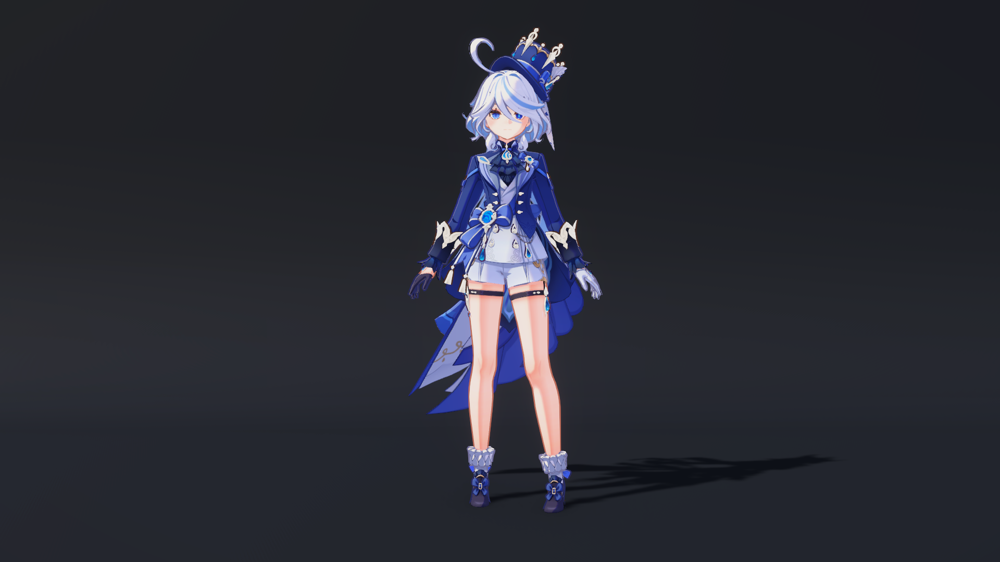

# Miku 3.0.0 使用手册

Miku 是面向生产使用的 Blender 5.x 到 Unity 6 材质转换器。公开 Blender 前端将
Standard PBR 语义导出为目标无关的 MaterialIR 2.0；Unity 导入可编辑 Shader Graph
资产，并提供四套由 Miku 独立编写的 Game Toon Shader/HLSL 预设供用户显式创建材质。

英文 [Miku Manual](../manual.md) 是规范版本；本手册逐项对应其章节和兼容承诺。
简要项目介绍见[中文 README](README.md)。



## 1. 支持环境

| 组件 | 版本 | 状态 |
| --- | --- | --- |
| Blender | 5.0–5.2（认证：5.2.0） | Windows 支持 |
| Unity Editor | 6000.0–6000.5（已验证：6000.4.5f1） | 技术线适配器 |
| Universal Render Pipeline | 已验证 17.4.0；允许严格匹配的 17.0–17.5 | 必需 |
| Shader Graph | 已验证 17.4.0；允许严格匹配的 17.0–17.5 | 版本专用后端 |
| Miku | 3.0.0 | Experimental（实验性） |

Blender 仅支持 5.0–5.2。Unity 6000.N 必须配套 URP 17.N 与 Shader Graph
17.N（N 为 0–5），并且两个包的精确版本必须相同。区间内未记录的稳定补丁会
先执行能力预检并显示“未经完整验证”诊断。Alpha、Beta、RC、Blender 5.3+、
Unity 6000.6+ 和包 17.6+ 会在写入资产前失败。本次正式支持平台仅为 Windows。

## 2. 从 Release 安装

从 [v3.0.0 GitHub Release](https://github.com/GenshinmasterJinHang/Miku-Material-Converter-Blender-to-Unity-/releases/tag/v3.0.0)
下载：

- `miku_shader_converter-3.0.0.zip`：Blender 5.0–5.2 扩展。
- `com.miku.shaderconverter-3.0.0.tgz`：Unity 6000.0–6000.5 单一包。
- `SHA256SUMS.txt`：发布完整性清单。

安装前对 ZIP 与 TGZ 运行 `Get-FileHash -Algorithm SHA256`，并逐项与
`SHA256SUMS.txt` 比对。

在 Blender 中选择 **编辑 > 偏好设置 > 扩展 > 从磁盘安装**并选中 ZIP。在 Unity 中
选择 **Window > Package Manager > + > Add package from tarball** 并选中 TGZ。
导入 Bundle 前，项目应使用 17.x 的 URP 和 Shader Graph。

源码开发时，从磁盘添加
`unity/Packages/com.miku.shaderconverter/package.json`。不要修改已安装 Blender 扩展
或验证项目中的副本。规范源码根目录是 `miku/`、`miku_blender/`、
`extensions/miku_shader_converter/` 和
`unity/Packages/com.miku.shaderconverter/`。

## 3. Blender：导出 Standard PBR

1. 在 Shader Editor 中打开材质，并选中活动材质槽包含该材质的对象。
2. 打开 **Miku** 侧栏并选择输出文件夹。
3. 可见路线固定为 **Standard PBR**。仅在源材质需要时修改法线约定和位移策略。
4. 仅在需要转换模式、保真策略、相加着色器能量策略、烘焙贴图质量或源标识派生时
   展开 **高级**。
5. 点击 **导出当前材质**。


导出器先快照材质并验证降低后的 IR，再创建暂存和输出文件。有效链路包含时间表达式时，
会以 `MIKU_TIME_INPUT_UNSUPPORTED` 失败，并且不会写入输出或烘焙请求。断开的时间节点
可以保留。需要动画时，请使用静态源或另行实现运行时逻辑。

Blender 界面不再提供 Game Toon 工作流选择、贴图角色猜测或旧标识迁移入口。`.blend`
中已有的工作流属性仍为历史兼容保留，底层 Python API 仍允许脚本和测试夹具显式传入
旧工作流；公开当前材质操作器始终生成 `standard_pbr`，不会重写旧属性。

### 烘焙质量

高级设置 **烘焙贴图质量** 支持 512、1024、2048 和 4096，默认 1024。转换计划
没有安排烘焙时，此设置不生效。烘焙使用隔离的临时数据，不修改源 `.blend` 文件。

### 导出资产所有权

输出文件夹包含确定性的 `.mikubundle`、报告和必要的烘焙资源。移动到 Unity 时必须
保留完整目录，不要重命名 Bundle 内文件或只复制 JSON。

## 4. Unity：导入可编辑 Bundle

将完整 `.mikubundle` 目录复制到 `Assets/` 下。导入器会生成版本专用 Shader Graph
包装图、由 Miku 管理的 Sub Graph、材质、报告和源映射；生成资产使用稳定 ID 和
确定性排序。

资产所有权规则如下：

- `*.generated.shadersubgraph` 和生成报告由 Miku 管理，可重新生成。
- 包装 `*.shadergraph` 在首次创建后由用户拥有。
- 只有明确选择完全重新生成时，才允许替换用户修改过的包装图。

3.0.0 不改变 MaterialIR 2.0、Bundle 1.0、Conversion Plan、Bake Result 或公开
Shader property/reference 名称。Unity 仍可读取历史 Bundle，包括旧的运行时契约；
当前 Blender 前端不会创建新的时间依赖 Bundle。

## 5. 内置 Game Toon Shader/HLSL 预设

Unity 包在四个运行时预设家族中直接附带 Miku 原创 Shader/HLSL 实现。它们不是从
游戏提取的 Shader，也不只是材质字段模板。

| 预设 | 部位 | 已实现功能和贴图类别 |
| --- | --- | --- |
| 原神（Genshin） | Body、Hair、Face、Eye | Light Map、阴影/头发 Ramp、Face SDF、头发高光、眼睛、描边和屏幕边缘光集成 |
| 崩坏：星穹铁道（HSR） | Body、Hair、Face、Eye | Light Map/Ramp 卡通着色、Face SDF、头发高光、眼睛和描边 |
| 鸣潮（Wuwa） | Body、Hair、Face、Eye、Effect | ID/Stockings、脸部基向量、Face ID/HET/SDF、Eye HET/HDMF/高光/EG、MatCap、特效和自发光 |
| 明日方舟：终末地（Endfield） | Body、Skin、Hair、Face、Eye、Mouth、Overlay、Effect、HairShadow | 材质参数、漫反射/高光 Ramp、阴影/颜色 LUT、Face SDF、头发 line/shift/refine、Overlay、Effect 和 HairShadow |

这 22 个有效材质部位均为 **Experimental（实验性）** 兼容预设，不承诺与任何游戏
逐像素一致，也不包含游戏模型、贴图、Logo、提取的 Shader 源码或其他游戏资产。

原神预设支持公开教程中的 `diffuse.a` 裁剪/自发光模式、UV1 背面双面渲染、
顶点色 A 通道描边宽度和 lightmap.a 分区描边颜色。这些控制均为可选的材质属性
（`_DiffuseA`、`_DoubleSided`、`_BackUV1`、`_OutlineColorMode` 等）；默认值
保持 Miku 原有外观。
身体与头发还可选绑定 `_NormalMap`/`_BumpScale`（`NormalMap` 贴图角色）；
开启 `_AREA_SKIN` 时，旧版肤色曲线只作用于 LightMap 标记的皮肤区域，布料和
披风保持自身颜色，不再被整体染色。

星穹铁道 Body 与 Hair 预设按教程字面公式解释 LightMap 绿色通道：
`HL = 0.5 * NdotL + 0.5`、`shadowAO = 2 * G`，最终
`signal = saturate(dot(HL.xx, shadowAO.xx))`，即
`saturate(4 * HL * G)`。Ramp 的 U 坐标固定为
`0.85 * signal + 0.15`。LightMap 蓝色通道先取反，再作为平滑阈值生成金属与
非金属共用的 Blinn-Phong 卡通高光 Mask；两个分支只在最终颜色和强度上不同。
旧材质中的阴影阈值中心、阴影阈值软度和 Ramp Offset 属性仍可反序列化，但不再
驱动这些已修正的公式。

星穹铁道 Face 不需要新增 LightMap。它使用现有输入提供参数化、仅作用于皮肤区域的
Blinn-Phong 卡通高光。FaceMap 蓝色通道继续表示鼻线，并与表面 `NdotV`、可调
幂次、强度和颜色组合，使鼻线保持视角相关，同时不会弱到无法辨认。以上仅改变
Shader 行为和材质属性，不改变 MaterialIR、Bundle、Schema 或贴图角色契约。

推荐的星穹铁道 Face 配置以 `_FaceSpecularStrength = 0.12`、
`_FaceSpecularExponent = 32`、`_NoseLinePower = 3` 和
`_NoseLineStrength = 8` 为起点。把 **Face Debug** 设为 `6` 可只看计算后的鼻线
Mask。若 Mask 存在但最终鼻线仍偏淡，可提高 `_NoseLineStrength` 或调暗
`_NoseLineColor`；若视角稍变鼻线就消失，可降低 `_NoseLinePower`。

### 文档渲染示例

<table>
  <tr><th>原神—胡桃</th><th>原神—芙宁娜</th></tr>
  <tr>
    <td></td>
    <td></td>
  </tr>
  <tr><th>崩坏：星穹铁道—布洛妮娅</th><th>鸣潮—菲比</th></tr>
  <tr>
    <td></td>
    <td></td>
  </tr>
  <tr><th colspan="2">明日方舟：终末地—洁尔佩塔</th></tr>
  <tr><td colspan="2" align="center"></td></tr>
</table>

> **非商业图片声明：**以上五张角色渲染图仅供非商业学习和文档参考，禁止用于任何
> 商业用途。相关角色、设计及知识产权归各自权利人所有；Miku 不授予任何游戏资产
> 使用权。这些 PNG 随源码文档跟踪，因此会出现在 GitHub 自动生成的源码归档中；
> 它们不适用 Miku 的 MIT 许可，也不进入可安装 ZIP/TGZ。

## 6. Unity 游戏卡通材质创建器

打开 **Miku > Game Toon > Materials > Create Material**。

1. 选择 `genshin_toon`、`hsr_toon`、`wuwa_toon` 或 `endfield_toon`。
2. 从第 5 节列出的过滤结果中选择材质部位。
3. 显式填写界面显示的 `Texture2D` 字段。字段按照所选包内 Shader 的公开二维贴图
   声明顺序排列。
4. 补齐所有标记为 **必填** 的字段，点击 **创建用户拥有的材质**，并在 `Assets/`
   下选择一个新的 `.mat` 路径。


旧 `_MainTex` 和带 `HideInInspector` 的兼容属性不会显示。除 Endfield Mouth 外，
所有部位的 `_BaseMap` 均为必填。Wuwa Body 只显示一个 **ID / Stockings Map**，创建时
同时绑定 `_IDMap` 和 `_StockingsMap`。

创建 Unity 对象前，向导会检查 Shader、输出路径、已有资产、字段数量、必填贴图和
属性名。随后在内存中绑定贴图、应用推荐配置、同步关键字，再创建用户拥有的 `.mat`。
它不会猜测文件名、搜索文件夹、修改 TextureImporter、覆盖材质、绑定 Renderer，
也不会修改 FBX 或 Prefab。

公开三参数 `CreateMaterialAsset(string, string, MikuGameMaterialPart)` API 仍可供脚本
显式创建空的用户材质模板；可见创建器使用带完整校验的配置化创建路线。

## 7. Unity 编辑器工具

### 7.1 Miku 设置

打开 **Miku > Settings**，进入 Unity 用户偏好中的 **Preferences/Miku**。可选择
English 或简体中文。设置只保存在当前用户的 `EditorPrefs` 中，不修改项目文件或
生成资产。语言边界详见第 8 节。

### 7.2 推荐皮肤与高光配置

在 Project 窗口选中一个或多个 Material 资产，然后选择
`Miku > Game Toon > Materials > Apply Recommended Skin & Highlight Profile`。确认后，
工具只更新每个
所选 Miku 预设 Shader 实际支持的属性、同步关键字并保存材质。操作支持 Undo，
不会修改 FBX 或 Prefab。缺少所需皮肤 Mask 时会报告
`MIKU_SKIN_MASK_TEXTURE_MISSING`，并禁用可能错误影响整个表面的皮肤调节。

### 7.3 Endfield 贴图导入审计

打开 **Miku > Game Toon > Textures > Import Audit**，指定 `Assets/` 下的文件夹，
再点击 **应用已识别的导入设置**。虽然名称包含 Audit，但这是会修改资产的工具：
它仅识别完整的 Endfield 文件名模式，调整 TextureImporter 的色彩空间、Wrap Mode、
Mipmap 和类型，然后重新导入变化的贴图；含糊的 `_M` 文件名保持不变。前后差异报告
写入 `Assets/Miku/Reports/endfield-texture-import-audit.json`。

应用前请提交或备份 importer 元数据。完成后检查 JSON 报告；若识别结果不符合预期，
使用版本控制或 Unity Undo 恢复。

### 7.4 平滑法线生成器

选中一个 Mesh 资产并打开 `Miku > Game Toon > Mesh > Smooth Normal Generator`。
确认显式 Source Mesh 和输出文件夹（默认 `Assets/Miku/ToonMeshes`），再设置位置容差、
平滑角度以及是否用骨骼权重区分位置相同的顶点。

工具只在克隆 Mesh 的 UV7/TEXCOORD7 中写入带标记的切线空间
`float4(normalTS.xyz, 2.0)` 平滑描边法线；它可随 SkinnedMeshRenderer 变形，旧的未标记
object-space UV7 仍可读取。源 Mesh 已有 UV7 时，**Preserve** 会阻止仅法线写入；选择
**Replace** 并确认后，也只会替换克隆上的 UV7。切线缺失或非法时会在写入前报告
`MIKU_TOON_TANGENTS_REQUIRED`。源 Mesh、Mesh/Texture Importer 和所有 Renderer 引用
都保持不变；源 Mesh 未开启 CPU 可读时同样不会修改 importer。详见
[迁移说明](../migrations/outline-tangent-space-v2.md)。

### 7.5 Game Toon Renderer Feature 安装器

打开 **Miku > Game Toon > Rendering > Game Toon Renderer Feature Installer**。
Preview 会同时显示 Geometry 与 Screen Rim 状态；Apply 会枚举并去重所有活动的
Universal Renderer Data，并在一个 Undo 事务内幂等安装
`MikuGameToonGeometryRendererFeature` 与 `MikuToonScreenRimRendererFeature`。
旧的 **Screen Rim Installer** 别名不再注册；重复或无效的 Feature 状态会在报告
成功前失败。

### 7.6 重建 Anime 全局 Volume Profile

仅在恢复 Miku 包自带参考配置时使用
`Miku > Game Toon > Rendering > Rebuild Anime Global Volume Profile`。命令会删除并重建
`Packages/com.miku.shaderconverter/Runtime/Profiles/MikuAnimeGlobalVolumeProfile.asset`，
写入 Miku 的 Neutral Tonemapping、颜色、Bloom 和 Vignette 默认值，然后选中该资产。
它会破坏直接写在这个包资产中的自定义修改，并且没有 Preview。自定义调色应保存在
单独的用户 Volume Profile 中；不可写安装包拒绝重建时，请重新安装包。

### 7.7 Endfield Volume 调色、可选 LUT 与教程光照

打开 **Miku > Game Toon > Rendering > Endfield LUT & Volume Installer**。默认
Volume-only 模式生成 Color Adjustments（曝光 `+0.35`、对比度 `+16`、饱和度 `+8`）、
恒等 Color Curves、Neutral Tonemapping、Bloom 与 Vignette，不需要 LUT。角色资源中的
cloth 与 female-skin LUT 只用于材质暗部，不能作为屏幕 LUT；高级显式屏幕 LUT 模式
会在写入前拒绝这类资源。工具支持 Preview、Undo 和逐字节失败回滚，不会自动把
Profile 绑定到场景。

工具会在写入前拒绝损坏或重复的 Renderer Feature/Local ID 状态，并仅在强制重导入确认
Feature 引用、执行配置和 Pass Material 已持久化后报告成功。

场景中添加且只添加一个 `MikuEndfieldLightingController` 才会启用 2.3.0 教程光照
贡献；没有控制器时旧的受光材质保持旧路径。Overlay 还需独立把 `_LightingMode`
从默认 0（Legacy Unlit）设为 1（Toon Lit Transparent），控制器不会自动切换它。
默认值、Body 双面、各部位行为及验收要求见
[终末地教程渲染指南](endfield-tutorial-rendering.md)。

### 7.8 Miku 材质 Inspector

选中使用 `MIKU/Genshin/`、`MIKU/HSR/`、`MIKU/Wuwa/` 或 `MIKU/Endfield/` Shader
的材质。自定义 Inspector 会显示 Shader 的公开属性、同步贴图关键字、提供受支持的
Wuwa/Endfield 调试视图、显示 Screen Rim 安装状态；存在配套 Recipe 时，还会显示经过
过滤的材质部位选择器。修改只影响所选材质；可使用 Undo，完成排查后应把调试视图恢复
为 **Final**。

### 7.9 Mesh Binding Description Inspector

选中生成的 `MikuMeshBindingDescription`，再选中一个同时具有 `MeshRenderer` 和
`MeshFilter`、且 Mesh 指纹与记录匹配的 GameObject。点击 **Apply to Selected
Renderer**，即可把记录的材质写入指定槽位。指纹不匹配时会报告
`MIKU_MESH_BINDING_MISMATCH`，不会执行绑定。成功操作会记录 Renderer Undo；条件允许
时优先使用生成的 Prefab。

### 7.10 Toon Material Recipe Inspector

`MikuToonMaterialRecipe` 记录生成基础材质、用户材质、工作流、部位、贴图绑定及 UV
变换、稳定标识和 Shader 家族版本。GUID 与版本字段是同步元数据，不应作为普通参数
编辑。需要更改带 Recipe 材质的部位时，请使用 Miku 材质 Inspector 的部位选择器，
使 Shader、绑定、推荐配置和 Recipe 同步更新。单独编辑 Recipe Inspector 原始字段
不会自动重新生成材质。

### 7.11 历史迁移工具

仅处理历史 MiGR 资产时，先显式选中资产或文件夹，再执行 **Miku > Migration > Dry
Run Selected MiGR Assets**，检查日志中的材质、动画曲线和生成元数据计数。提交或备份
项目后，才执行 **Miku > Migration > Upgrade Selected MiGR Assets**，应用属性名和
元数据名称迁移。

迁移不会遍历场景对象，也不会修改 Renderer 材质绑定。遇到已退役 Generic Toon 材质
时会明确拒绝，不会静默替换 Shader。正常 2.3.0 创作无需使用这些命令。

## 8. 编辑器语言

Blender 跟随 Blender 的英文/简体中文界面翻译。Unity 的 **Miku > Settings** 偏好按
当前用户保存在 `com.miku.shaderconverter.editorLanguage`。

该偏好不改变 Unity 全局语言、项目文件、生成资产、稳定属性名、诊断、JSON 或静态
菜单路径。Miku 自绘窗口、自定义 Inspector、ShaderGUI 标签、对话框、帮助框、Undo
标签和友好状态消息会跟随偏好切换。

## 9. 诊断与排查

- `MIKU_TIME_INPUT_UNSUPPORTED`：从 Blender 有效输出链中移除时间依赖，或仅在
  Unity 侧继续读取历史 Bundle。
- `MIKU_WORKFLOW_RETIRED:generic_toon`：从 Blender 导出 Standard PBR，或使用四套
  Unity Game Toon 预设之一。
- `MIKU_REQUIRED_TEXTURE_MISSING`：补齐创建器要求的 Base Map；Endfield Mouth 是
  唯一例外。
- `MIKU_MATERIAL_ALREADY_EXISTS`：选择新的 `.mat` 路径；Miku 不覆盖现有材质。
- `MIKU_ASSET_OUTPUT_PATH_INVALID`：选择 `Assets/` 下且不含 `.`、`..` 段的路径。
- `MIKU_TEXTURE_AUDIT_FOLDER_INVALID`：应用 Endfield 导入配置前选择有效 Unity 文件夹。
- `MIKU_RENDERER_DATA_SELECTION_REQUIRED`：应用 Screen Rim 前选择 Universal
  Renderer Data。
- `MIKU_MESH_BINDING_MISMATCH`：使用生成 Prefab，或选择 Mesh 指纹匹配的 Renderer。
- Shader 缺失或图格式不兼容：检查 Unity、URP 和 Shader Graph 是否为精确验证组合。

升级后若旧项目出现 Missing Shader，包不会删除材质。请先备份，再有意识地使用
Standard PBR 或受支持的 Unity Game Toon 预设重建用户材质。

## 10. 开发与验证

```powershell
py -3.13 -m unittest discover -s tests -p "test_*.py"
py -3.13 tools/ci/run_checks.py --profile pr
py -3.13 tools/ci/run_checks.py --profile release
py -3.13 tools/release/build_release.py --output-dir artifacts
```

固定 Blender 验证程序是
`C:\SteamLibrary\steamapps\common\Blender\blender.exe`。已验证 Unity 程序是
`C:\Program Files\Unity\Hub\Editor\6000.4.5f1\Editor\Unity.exe`。使用生成证据前必须
先断言编辑器版本。

分发构建前，请阅读 [CONTRIBUTING.md](../../CONTRIBUTING.md)、
[SECURITY.md](../../SECURITY.md)、[SUPPORT.md](../../SUPPORT.md)、
[兼容性矩阵](../compatibility.md)和[发布流程](../release/process.md)。

## 11. 许可证与文档素材

仓库中采用 MIT 的代码继续适用 MIT License；带有其他 SPDX 声明的文件（包括
Blender Bake Worker）继续适用各自条款。第 5 节中的五张角色渲染图单独限制为仅供
非商业学习和文档参考，禁止用于任何商业用途。图片哈希及适用范围记录在
[文档图片来源记录](../provenance/documentation-images.md)和
[第三方声明](../../THIRD_PARTY_NOTICES.md)中。该图片限制不会改变任何现有代码许可证。
