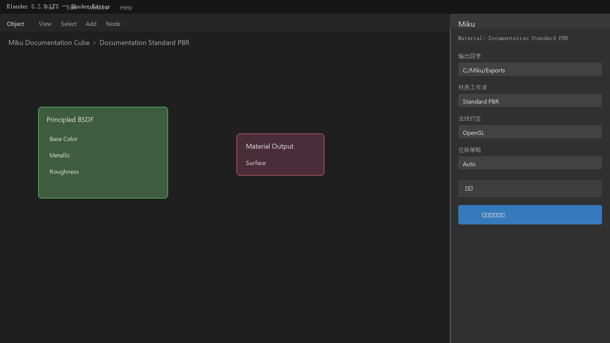
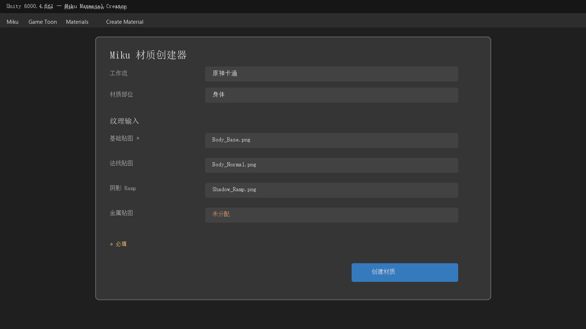

# Miku 2.2.8 使用手册

Miku 是面向生产使用的 Blender 5.2 到 Unity 6 材质转换器。公开的 Blender 前端
将 Standard PBR 语义导出为目标无关的 MaterialIR 2.0，Unity 再生成可继续编辑的
Shader Graph 资源。游戏卡通材质在 Unity 中显式创建，不在 Blender 面板中选择。

对应的英文规范版本是[English Manual](../manual.md)；简要项目介绍见
[中文 README](README.md)。


## 1. 支持环境

| 组件 | 版本 | 状态 |
| --- | --- | --- |
| Blender | 5.2.0 | Windows 已验证 |
| Unity Editor | 6000.4.5f1 | Windows 已验证 |
| Universal Render Pipeline | 17.4.0 | 必需 |
| Shader Graph | 17.4.0 | 版本专用后端 |
| Miku | 2.2.8 | Experimental（实验性） |

其他版本没有自动兼容承诺，必须单独验证。不兼容的 Shader Graph 格式应明确报错，
而不是猜测字段。

## 2. 从 Release 安装

从 [v2.2.8 GitHub Release](https://github.com/GenshinmasterJinHang/Miku-Material-Converter-Blender-to-Unity-/releases/tag/v2.2.8)
下载：

- `miku_shader_converter-2.2.8.zip`：Blender 5.2 扩展。
- `com.miku.shaderconverter-2.2.8.tgz`：Unity 包。
- `SHA256SUMS.txt`：发布完整性清单。

在 Blender 中选择 **编辑 > 偏好设置 > 扩展 > 从磁盘安装**，选中 ZIP。在 Unity 中
选择 **Window > Package Manager > + > Add package from tarball**，选中 TGZ。导入
Bundle 前，项目应使用 URP 17.4.0 和 Shader Graph 17.4.0。

源码开发时，从磁盘添加
`unity/Packages/com.miku.shaderconverter/package.json`。不要修改已安装扩展副本或
验证项目内嵌副本；规范源码根目录是 `miku/`、`miku_blender/`、
`extensions/miku_shader_converter/` 和 `unity/Packages/com.miku.shaderconverter/`。

## 3. Blender：导出 Standard PBR

1. 在 Shader Editor 中打开材质，并选中带有该材质的对象和活动材质槽。
2. 打开 **Miku** 侧栏并选择输出文件夹。
3. 可见的材质路线固定为 **Standard PBR**。只有在源材质需要时设置法线约定和置换策略。
4. 只有需要时才展开 **高级**，其中包含转换模式、保真策略、相加着色器能量策略、
   烘焙贴图质量和源标识派生。
5. 点击 **导出当前材质**。



导出器会先快照活动材质、构建和检查 IR，再创建输出目录和暂存文件。有效链路包含
时间表达式时，以 `MIKU_TIME_INPUT_UNSUPPORTED` 失败，而且不会写入输出或烘焙请求。
断开的时间节点允许存在。需要动画时，应改用静态源或另行实现运行时逻辑。

Blender 界面不再提供游戏工作流选择、贴图角色猜测或旧标识迁移入口。文件中已有的
工作流属性仍保留以兼容旧数据，底层 Python API 仍可由脚本显式传入旧工作流；但是
公开的当前材质操作器始终生成 `standard_pbr`，不会重写这些旧属性。

### 烘焙质量

高级设置 **烘焙贴图质量** 支持 512、1024、2048 和 4096，默认 1024。当转换计划
不包含烘焙任务时该设置无效。烘焙使用隔离的临时数据，不修改源 `.blend` 文件。

### 导出资产所有权

输出文件夹包含确定性的 `.mikubundle`、报告和必要的烘焙资源。移动到 Unity 时必须
保留完整目录，不要只复制 JSON 或重命名 Bundle 内文件。

## 4. Unity：导入可编辑 Bundle

将完整 `.mikubundle` 目录复制到 `Assets/` 下。导入器会生成版本专用 Shader Graph
包装图、Miku 管理的生成 Sub Graph、材质、报告和源映射。生成资产使用稳定 ID 和
确定性的排序。

所有权规则如下：

- `*.generated.shadersubgraph` 和生成报告由 Miku 管理，可重新生成。
- 包装 `*.shadergraph` 在首次创建后由用户拥有。
- 只有明确选择完全重新生成时，才允许替换用户修改过的包装图。

2.2.8 不改变 MaterialIR 2.0、Bundle 1.0、Conversion Plan、Bake Result 或公开
Shader property/reference 名称。Unity 仍可读取历史 Bundle（包括旧的运行时时间契约），
但当前 Blender 前端不会创建新的含时间 Bundle。

## 5. Unity 游戏卡通材质创建器

打开 **Miku > Game Toon > Materials > Create Material**。选择一个工作流和一个过滤后
的材质部位，再显式填写可见贴图字段。工具不会检查文件名或文件夹，也不会修改导入器设置。

| 工作流 | 部位 |
| --- | --- |
| 原神 | Body、Hair、Face、Eye |
| 鸣潮 | Body、Hair、Face、Eye、Effect |
| HSR | Body、Hair、Face、Eye |
| 终末地 | Body、Skin、Hair、Face、Eye、Mouth、Overlay、Effect、HairShadow |

字段来自对应 Shader 的公开二维贴图属性，并保持声明顺序。旧 `_MainTex` 和隐藏的
兼容属性不会显示。除 Endfield Mouth 外，所有部位的 `_BaseMap` 都是必填；Endfield
Mouth 的口腔贴图可选。Wuwa Body 的可见 ID 贴图会同时绑定到 Shader 所需的 ID 和丝袜源。



创建前会检查 Shader、输出路径、已有资产、字段数量和必填贴图。随后创建用户拥有的
`.mat`，写入所选贴图，应用现有的皮肤/高光推荐配置并同步关键字。它不会绑定 Renderer、
修改 FBX 或 Prefab、覆盖已有材质，也不会隐式创建 Recipe。

现有三参数 `CreateMaterialAsset` API 仍可供脚本创建空的用户材质模板；菜单向导使用上面
的配置化显式贴图流程。

## 6. 编辑器语言

Blender 跟随 Blender 的英文/简体中文界面翻译。Unity 在 **Miku > Settings** 提供独立
的 per-user 设置，可选择 `English` 或 `简体中文`，保存于 `EditorPrefs` 的
`com.miku.shaderconverter.editorLanguage`。

该设置不改变 Unity 全局编辑器语言，不写入项目、生成资产、稳定属性名、诊断、JSON 或
静态菜单路径。Miku 自绘窗口、自定义 Inspector、ShaderGUI 标签、对话框、帮助框、撤销
标签和友好状态文本会跟随偏好切换。

## 7. 诊断与排查

- `MIKU_TIME_INPUT_UNSUPPORTED`：从 Blender 有效输出链中移除时间依赖；历史 Bundle 仍可
  在 Unity 侧读取。
- `MIKU_WORKFLOW_RETIRED:generic_toon`：选择 Standard PBR 或受支持的 Unity 游戏卡通
  工作流，不会静默替换外观。
- `MIKU_REQUIRED_TEXTURE_MISSING`：在 Unity 创建器中补齐必填字段；只有 Endfield Mouth
  的 Base Map 可选。
- `MIKU_ASSET_OUTPUT_PATH_INVALID`：选择 `Assets/` 下的 `.mat` 路径，并避免 `.`、`..`。
- Shader 缺失或版本不兼容：检查 Blender、Unity、URP 和 Shader Graph 是否为精确组合。

升级后如果旧项目材质显示 Missing Shader，包不会删除该材质。请先备份项目，再有意识地
选择 Standard PBR 或 Unity 游戏卡通材质，重新导出或重新创建用户材质。

## 8. 开发与验证

```powershell
py -3.13 -m unittest discover -s tests -p "test_*.py"
py -3.13 tools/ci/run_checks.py --profile pr
py -3.13 tools/ci/run_checks.py --profile release
py -3.13 tools/release/build_release.py --output-dir artifacts
```

固定的 Blender 验证程序是
`C:\SteamLibrary\steamapps\common\Blender\blender.exe`；固定的 Unity 验证程序是
`C:\Program Files\Unity\Hub\Editor\6000.4.5f1\Editor\Unity.exe`。使用生成证据前，
必须先断言编辑器版本。

发布前请阅读 [CONTRIBUTING.md](../../CONTRIBUTING.md)、[SECURITY.md](../../SECURITY.md)、
[SUPPORT.md](../../SUPPORT.md)、[兼容性矩阵](../compatibility.md) 和
[发布流程](../release/process.md)。
